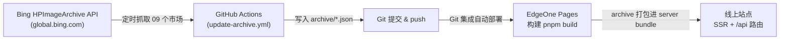

# Bing Wallpaper Archive

基于 Nuxt 3 的必应每日壁纸归档站，支持多语言市场、多种分辨率，内置定时自动抓取与更新。本站已适配 **腾讯云 EdgeOne Pages** 部署。

- ⚒️ Nuxt 3 + EdgeOne Pages
- 🔄 GitHub Actions 定时抓取 Bing 官方接口并写入仓库归档
- 🇺🇳 9 个市场：`de-DE` / `en-CA` / `en-GB` / `en-IN` / `en-US` / `fr-FR` / `it-IT` / `ja-JP` / `zh-CN`

## ✨ 特性

- [x] 🔄 每日自动更新（GitHub Actions 定时任务）
- [x] 🇺🇳 多语言市场支持
- [x] 🏞️ 多种分辨率
- [x] ⚡ SSR 首屏直出 + 服务端缓存，SEO 友好（`sitemap.xml` / `robots.txt` 自动生成）

## 🏗️ 工作原理



关键点：**归档数据（`archive/`）在构建时被打包进服务端产物**（Nitro `serverAssets`）。
因此 `archive/` 一旦有更新，必须触发一次**重新构建**，线上才会生效。

## 🚀 部署到 EdgeOne Pages

> 你只需要完成下面 5 步，其余配置（构建命令、Node 版本、超时、安装命令、CI 工作流）都已在仓库里备好。

### 前置准备

1. 把本仓库 **Fork 或导入到你自己的 GitHub 账号**（推荐 Fork，方便同步上游更新）。
2. 一个 EdgeOne Pages 账号：
   - 国内版控制台：https://console.cloud.tencent.com/edgeone/pages
   - 国际版控制台：https://pages.edgeone.ai/

### 第 1 步：从 Git 仓库创建项目

在 EdgeOne Pages 控制台点击「新建项目」→「导入 Git 仓库」，选择你刚才 Fork 的仓库。
平台会自动识别框架为 **Nuxt**，无需手动选择模板。

### 第 2 步：确认构建配置

仓库根目录的 [`edgeone.json`](./edgeone.json) 已经覆盖了默认配置，**通常无需在控制台再改**：

| 配置项 | 值 | 说明 |
| --- | --- | --- |
| 框架预设 | Nuxt | 平台自动识别 |
| 安装命令 | `pnpm install --no-frozen-lockfile` | 由 `edgeone.json` 覆盖 |
| 构建命令 | `pnpm build`（即 `nuxt build`） | 由 `edgeone.json` 覆盖，**必须是 build 而非 generate** |
| Node 版本 | `22.17.1` | 由 `edgeone.json` 覆盖，**必须 ≥ 22.12.0**，见下方注意事项 10 |
| 函数超时 | 60 秒 | 由 `edgeone.json` 覆盖，供 `/api/updates` 拉取 9 个市场使用 |

如果控制台里的「安装命令 / 构建命令 / Node 版本」与上表不一致，请手动改成一致，或直接依赖 `edgeone.json`。

### 第 3 步：配置环境变量（重要）

在「项目设置 → 环境管理 → 环境变量」中，为 **生产**（以及需要的话为 **预览**）环境添加：

| 变量名 | 值 | 必填 |
| --- | --- | --- |
| `NUXT_SITE_URL` | 你站点的完整地址，例如 `https://your-app.edgeone.app`（**带 `https://`，结尾不要斜杠**） | ✅ 必填 |

> 不配置该变量的后果：`sitemap.xml` 和 `robots.txt` 里会出现 `http://localhost:3000` 的错误域名。
> 绑定自定义域名后，请把这里同步改成自定义域名，并重新部署一次。

### 第 4 步：部署

保存配置并点击「部署」。首次构建会安装依赖并执行 `nuxt build`，完成后即可通过平台分配的域名访问。

### 第 5 步：开启自动更新

1. 打开你 Fork 仓库的 **Actions** 页面，若顶部有提示，点击 **I understand my workflows, go ahead and enable them**（首次 Fork 必须手动启用）。
2. 进入 **Update Archive** 工作流，点击 **Run workflow** 手动跑一次，确认能成功抓取并提交。
3. 之后它会按计划自动运行（见下方「注意事项」中的时区说明）。

到这里部署就完成了，你不需要再改动任何代码。

## ⚙️ 配置文件说明

### `edgeone.json`

```json
{
  "installCommand": "pnpm install --no-frozen-lockfile",
  "buildCommand": "pnpm build",
  "nodeVersion": "22.17.1",
  "cloudFunctions": {
    "maxDuration": 60
  }
}
```

- 用 `--no-frozen-lockfile` 而非默认的 `pnpm install`：升级依赖后锁文件可能与 `package.json` 短暂不同步，此参数可避免构建因锁文件校验失败。
- `nodeVersion` **必须是 ≥ 22.12.0 的预装版本**（可选 `22.17.1 / 22.21.1 / 24.5.0 / 24.11.0 / 24.18.0`）。**不要用 `22.11.0`**：Nuxt 3.21 依赖的 `oxc-parser` 原生绑定要求 `^20.19.0 || >=22.12.0`，低于该版本时 pnpm 会把可选依赖跳过，导致 `nuxt prepare` 报 `Cannot find native binding`。
- `cloudFunctions.maxDuration` 取值范围 10–120 秒（默认 30），本案用于 `/api/updates`（会串行请求 9 个市场的 Bing 接口）。旧字段名 `nodeFunctionsConfig` 已废弃，仅会打印一条 deprecation 警告。

### `nuxt.config.ts`

- `site.url` 读取环境变量 `NUXT_SITE_URL`，未配置时回退到 `http://localhost:3000`，仅用于本地开发。
- `nitro.serverAssets` 把 `archive/` 目录注册为服务端资源 `assets/archive`，构建时被打包进服务端产物。

### `.github/workflows/update-archive.yml`

- 触发方式：定时（UTC `10:39` 与 `18:39`，对应北京时间 `18:39` 与次日 `02:39`）+ 手动 `workflow_dispatch`。
- 抓取脚本：`scripts/update-archive.mjs`，直连 `https://global.bing.com/HPImageArchive.aspx`，不依赖线上站点。
- 仅当 `archive/` 有实际变化时才提交（幂等），无更新则跳过，不产生空提交。
- 提交身份默认回退为 GitHub Actions 机器人；如需自定义，在仓库 **Settings → Secrets and variables → Actions → Variables** 添加 `USER_NAME` / `USER_EMAIL`（注意是 Variables，不是 Secrets）。
- 部署触发二选一（下方详述）：默认用 **EdgeOne 的 Git 自动部署**；也可选配 **部署钩子**。

## ⚠️ 注意事项（重点）

1. **构建模式必须是 `nuxt build`（SSR），不能用 `nuxt generate`。**
   本项目依赖 `/api/*` 服务端路由，纯静态产物会缺失这些接口。`edgeone.json` 已固定为 `pnpm build`。
2. **`NUXT_SITE_URL` 必填**，且要带 `https://`。改域名后必须重新部署才会生效（环境变量变更不影响历史部署）。
3. **`archive/` 更新后必须重新构建**：数据在构建时被打包，仅提交 `archive/` 而不重新部署，线上不会变化。默认的 Git 集成会自动完成这一步。
4. **不要同时启用「Git 自动部署」和「部署钩子（Deploy Hook）」**，否则一次更新会触发两次构建。二选一：
   - **方案 A（推荐，默认）**：使用 EdgeOne 的 Git 集成，`push` 到关联分支即自动部署。无需任何额外配置。
   - **方案 B（可选）**：若你的项目不是通过 Git 集成部署，可在仓库 **Settings → Secrets and variables → Actions → Secrets** 添加 `EDGEONE_DEPLOY_HOOK`（值为 EdgeOne 控制台生成的部署钩子地址）。工作流检测到该 Secret 后会在归档变更时 `POST` 触发部署；未配置则自动跳过，交由 Git 集成完成。
5. **时区**：GitHub Actions 的 `cron` 使用 UTC。当前为 UTC `10:39 / 18:39`，即北京时间 `18:39 / 次日 02:39`。需要调整时记得换算。
6. **定时任务会被自动暂停**：仓库连续 60 天无提交活动时，GitHub 会自动停用计划的定时任务。届时手动跑一次 `Run workflow` 即可恢复。
7. **Fork 后需手动启用 Actions**，见「第 5 步」。
8. **GitHub Actions 需要写权限**：工作流已声明 `permissions: contents: write` 才能 push 归档提交。若你的仓库策略限制了默认 Token 权限，请在 **Settings → Actions → General → Workflow permissions** 选择 *Read and write permissions*。
9. **EdgeOne 对 Nuxt 的能力边界**：官方支持 Nuxt SSR / SSG / ISR，但 **不支持 Nuxt Layer**，`@nuxt/image` 的图片优化也不支持（本项目均未使用）。
10. **Node 版本必须 ≥ 22.12.0**（`edgeone.json` 已设为 `22.17.1`）。这是最容易踩的坑：EdgeOne 默认的 `22.11.0` 低于 Nuxt 3.21 依赖的 `oxc-parser` 原生绑定所要求的 `^20.19.0 || >=22.12.0`，pnpm 会因此跳过这些可选依赖，构建时在 `nuxt prepare` 阶段报 `Cannot find native binding`。若你在控制台手动指定过 Node 版本，请同步改成 `22.17.1` 或更高。
11. **Nuxt 版本要求**：EdgeOne Pages 要求 Nuxt `>= 3.16.0`，本项目使用 `3.21.11`，升级依赖时请勿降级。
12. **依赖兼容性**：UnoCSS 需 `66.x` 以兼容 Nuxt 3.21 所依赖的 Vite 7；若自行升级 Nuxt，请同步核对 UnoCSS 版本。
13. **首次访问 `/api/updates` 可能较慢**：它会实时请求 Bing 的 9 个市场接口。站点主流程（`/api/image`、`/api/images`）读取的是本地归档，响应很快，不受影响。

## 🧑‍💻 本地开发

```bash
pnpm install
pnpm dev          # 开发模式 http://localhost:3000
pnpm build        # 生产构建（SSR）
pnpm preview      # 预览生产构建
node scripts/update-archive.mjs   # 手动抓取壁纸到 archive/
```

本地若不设置 `NUXT_SITE_URL`，`sitemap.xml` / `robots.txt` 会使用 `http://localhost:3000`，属正常现象。

## 🔁 手动触发一次更新

- **更新归档**：仓库 Actions → Update Archive → Run workflow。
- **重新部署**：EdgeOne 控制台 → 项目 → 部署 → 重新部署；或向关联分支推一次提交。

## ❓常见问题

- **安装依赖失败：`Cannot find native binding ... oxc-parser`** → Node 版本过低（EdgeOne 默认 `22.11.0`）。把 Node 版本改为 `22.17.1` 或更高后重新部署，详见注意事项 10。
- **页面正常但 `robots.txt` 里域名是 `localhost`** → 未配置 `NUXT_SITE_URL` 或配置后未重新部署。
- **构建失败，提示锁文件不一致** → `edgeone.json` 已使用 `--no-frozen-lockfile`；若仍在控制台手动指定了安装命令，请去掉 `--frozen-lockfile`。
- **归档有更新但线上没变** → 归档更新后没有触发重新构建，或同时开启了 Git 集成与钩子导致构建被跳过/重复。
- **定时更新突然停了** → 仓库 60 天无活动被 GitHub 暂停，手动运行一次工作流即可恢复。

## 📄 数据来源与致谢

- 壁纸数据来自 Bing 官方接口 `https://global.bing.com/HPImageArchive.aspx`。
- 思路与历史数据参考：
  - [zkeq/Bing-Wallpaper-Action](https://github.com/zkeq/Bing-Wallpaper-Action/tree/main/data)
  - [flow2000/bing-wallpaper-api](https://github.com/flow2000/bing-wallpaper-api/tree/master/data)
  - [zenghongtu/bing-wallpaper](https://github.com/zenghongtu/bing-wallpaper/blob/main/json/data.json)
- 部署能力由 [EdgeOne Pages](https://edgeone.cloud.tencent.com/pages) 提供。